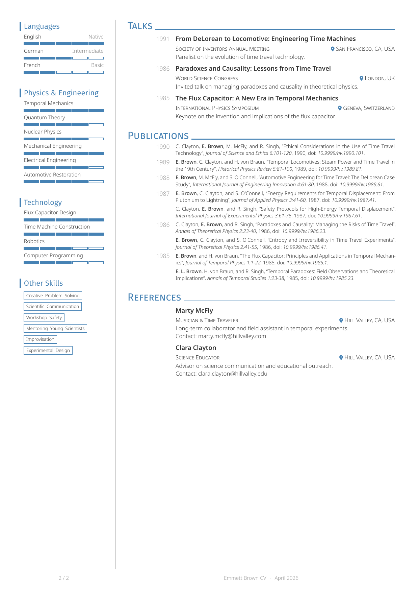
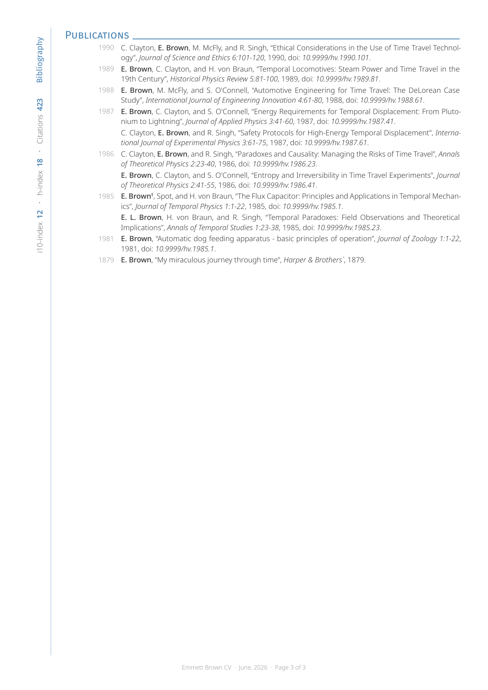
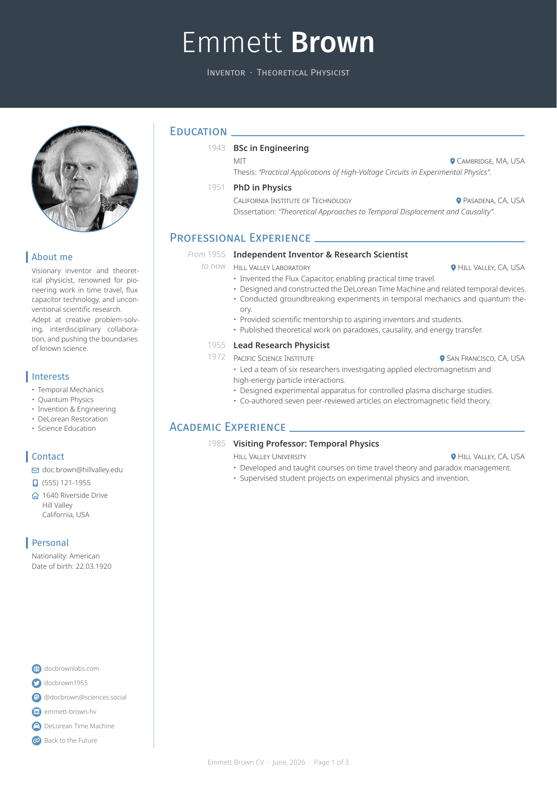
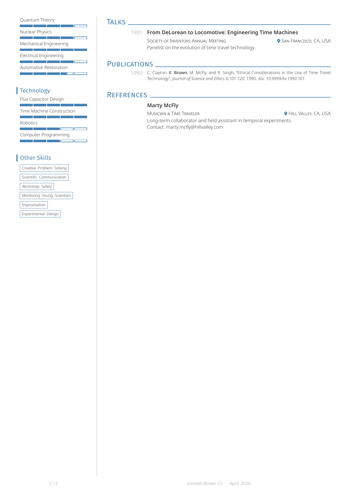
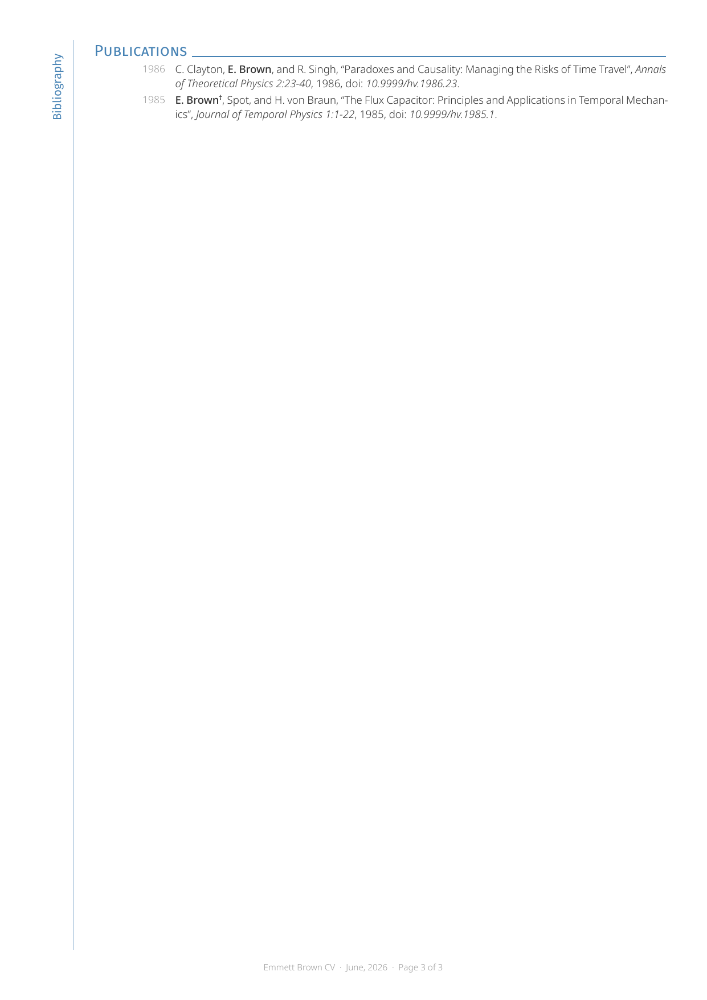

# Quarto CV Template

A flexible CV template powered by Quarto and Typst using the [Neat CV](https://github.com/dialvarezs/neat-cv) template.

## Features

- Content is stored as YAML files (see `data/`)
- Structure is defined using YAML config files (see `versions/`)
  - A new version with selected sections and entries can be created without needing to modify the content files
- Optional GitHub repository stats (stars and forks) can be fetched and displayed next to entry titles
- Simple commands for rendering etc.
- Automated checks for spelling etc.

## Quick Start

1. Edit your content:

- `data/config.yml`      (Document settings)
- `data/meta.yml`        (Personal metadata)
- `data/sidebar.yml`     (Sidebar entries)
- `data/sections/*.yml`  (Section content)

2. Render a CV version:

```bash
just render full
just render short
```

3. Find outputs in:

- `output/full.md`
- `output/full.pdf`
- `output/short.md`
- `output/short.pdf`

## Prerequisites

**Software:**

- [Quarto](https://quarto.org/)
- [R](https://cran.r-project.org/)
  - [**{yaml}**](https://yaml.r-lib.org/)
  - [**{glue}**](https://glue.tidyverse.org/)
  - [**{purrr}**](https://purrr.tidyverse.org/)
  - [**{jsonlite}**](https://jeroen.r-universe.dev/jsonlite) *(required for GitHub stats)*
- [`just`](https://just.systems/)

**Fonts:**

- [Fira Sans](https://fonts.google.com/specimen/Fira+Sans)
- [Noto Sans](https://fonts.google.com/specimen/Noto+Sans)
- [Noto Sans Mono](https://fonts.google.com/specimen/Noto+Sans+Mono)
- [FontAwesome](https://fontawesome.com)

Fonts can be set in `config.yml` but FontAwesome is always required for symbols.

**Development:**

- [`pre-commit`](https://pre-commit.com/)
- [`yamllint`](https://yamllint.readthedocs.io/en/stable/)
- [`codespell`](https://github.com/codespell-project/codespell)
- [`ruff`](https://docs.astral.sh/ruff)
- [**{lintr}**](https://lintr.r-lib.org/)
- [**{styler}**](https://styler.r-lib.org/)
- [Poppler](https://poppler.freedesktop.org/)

## Repository structure

```text
.
├── data/  
│   ├── config.yml            # Document-level settings
│   ├── meta.yml              # Personal metadata
│   ├── sidebar.yml           # Sidebar content
│   └── sections/             # Section content files
├── docs/
│   └── previews/             # PNG previews used in the README
├── output/                   # Rendered PDFs and Markdown files
├── scripts/
│   ├── github-stats.R        # GitHub API helpers for fetching repo stats
│   ├── render-markdown.R     # Render a CV version to Markdown from YAML data
│   ├── render-previews.sh    # Generate PNG previews from rendered PDFs
│   └── render.sh             # Render a CV version with Quarto
├── templates/
│   └── cv.qmd                # Main Quarto CV template
├── versions/                 # Version definitions
├── justfile                  # Command recipes
├── README.md                 # This README
├── .codespell-ignore         # Words ignored by codespell
├── .pre-commit-config.yaml   # pre-commit config file
└── .yamllint.yml             # YAMLLint config file
```

## Commands

Run `just` to see the available commands:

```bash
Available recipes:
    default                   # Show help

    [render]
    render VERSION            # Render a specific CV version by name
    render-all                # Render all available CV versions
    render-previews *VERSIONS # Export preview PNGs from existing PDFs
    refresh-previews          # Render all versions and regenerate preview PNGs

    [clean]
    clean VERSION             # Clean a specific version's output
    clean-all                 # Clean all generated output files

    [view]
    view VERSION              # View a specific version's PDF

    [validate]
    validate                  # Run all validation checks
    validate-yaml             # Validate YAML files
    spell-check               # Check spelling across all files
    format-python             # Format Python files with ruff
    lint-r                    # Lint and style R code (templates and scripts)
    check                     # Run pre-commit checks manually on all files
    install-hooks             # Install pre-commit hooks

    [info]
    info                      # Show information about the CV system
    list                      # List all available CV versions

    [help]
    help                      # Show help for all recipes
    recipes                   # List recipes
    usage RECIPE              # Show recipe usage

Use 'just usage RECIPE' for details on a specific command
```

## Output Examples

### Full Version

Including all example entries

 


### Short Version

Including selected entries

 


## Versions reference

To create a new CV version, create a new YAML file in `versions/`.
Versions are structured as a list of **parts** under the top-level `parts:` key.
Each part defines a page layout type, its sidebar (if applicable), and the sections to render in the body.

```yaml
parts:
  - type: standard              # Full sidebar layout (default if type is omitted)
    sidebar: sidebar.yml        # Sidebar file (in `data/`); omit or NULL for empty sidebar
    sections:
      - name: Section           # Section name
        type: section           # Section type (see below)
        data: education.yml     # File in `data/sections/`
        title_field: title
        institution_field: institution
        location_field: location
        date_field: date
        from_field: from
        to_field: to
        desc_field: description
        url_fields: [field1, field2]
        entries: all            # "all" or a list of entry IDs

  - type: thin                  # Thin sidebar layout
    label: "Bibliography"       # Optional rotated label in the thin sidebar
    metrics:                    # Optional metrics displayed in the thin sidebar
      - label: "h-index"
        value: "18"
      - label: "Citations"
        value: "280"
    sections:
      - name: Publications
        type: publications
        data: publications.yml
        highlight_authors: ["Last, First"]
        max_authors: 5
        entries: all
```

**Part types:**

- `standard` — full-width sidebar layout (`cv-with-side`). Set `sidebar` to a filename (in `data/`) to populate the sidebar.
- `thin` —  thin sidebar layout (`cv-thin-side`). Supports optional `label` and `metrics`.

Parts are separated by automatic page breaks. The first part does not get a page break.

**Section types** (within a part's `sections:` list):

- `"publications"` — renders a publication list from Hayagriva YAML
- `"reference"` — renders reference entries using `reference()` (name/role instead of title/institution)
- `"new-page"` — inserts a column break within the current part
- Anything else is treated as a standard `entry()` section

The `*_field` fields map fields in the data YAML to fields used by the Neat CV template.
`entries` can be `"all"` or a list of entry IDs:

```yaml
    entries:
      - entry1
      - entry2
```

Publications sections can have the following additional fields:

```yaml
    highlight_authors: ["Last, First"]  # Names to highlight in author lists
    max_authors: 5                      # Max authors shown before "et al" (default: 10)
    joint_authorship: NULL              # Symbol to indicate joint authorship, e.g. "\*"
```

Individual publication entries can include a `corresponding-author` field to mark the
corresponding author with a dagger (†):

```yaml
mypub2024:
  type: article
  title: "My Paper Title"
  author:
    - Smith, John
    - Doe, Jane
  corresponding-author: Smith, John
  date: 2024
  ...
```

### Reference sections (`reference`)

Use `type: reference` for sections listing people (supervisors, collaborators, etc.).
This uses the `reference()` function from Neat CV instead of the generic `entry()`.
The field mappings work the same way:

```yaml
  - name: References
    type: reference
    data: references.yml
    title_field: name       # maps to the "name" parameter
    institution_field: role # maps to the "role" parameter
    desc_field: details
    entries: all
```

## GitHub repository stats

Sections can display GitHub star and fork counts next to entry titles.

**1. Add `github: owner/repo` to an entry in a section data file:**

```yaml
- id: my-package
  title: My R Package
  github: owner/my-package
  description: An R package for doing things.
```

**2. Enable stats for that section in the version config with `github_stats: true`:**

```yaml
sections:
  - name: Software
    data: software.yml
    github_stats:           # Fetch and display GitHub stars/forks for entries
      enabled: true         # Whether or not this is enabled, default: True
      field: title          # The field to add stats to, default: "title'
      format: "{field} ({stars} stars, {forks} forks)"
    entries: all
```

When rendered, the field value is replaced with the formatted value including GitHub stats.
For example, with this format the title becomes **My package (1234 stars, 56 forks)**.

**Notes:**

- Stats are fetched from the [GitHub REST API](https://docs.github.com/en/rest/repos/repos#get-a-repository) at render time using unauthenticated requests
- Entries without a `github` field are not affected
- If a request fails (e.g., due to rate limiting or a missing repository), a warning is issued and the title is left unchanged
- Requires the **{jsonlite}** R package is required
